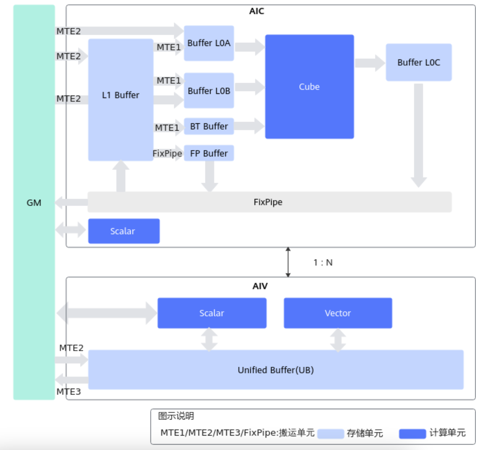

# Ascend NPU Hardware Spec

昇腾 Ascend 910B (atlas A2) 和 910C (atlas A3) 均是分离架构。

- AIC架构  
  - 包含5个并行执行单元(搬运单元和计算单元):MTE1,MTE2,MTE3, Cube,Scalar
  - 包含7个内存单元:GM(核外),L1,L0A,L0B,L0C,BiasTable Buffer, Fixpipe Buffer

- AIV架构
  - 包含4个并行执行单元:MTE2,MTE3,Vector,Scalar
  - 包含2个内存单元:GM(核外),UB

- 典型计算数据流
  - Vector计算: `GM-UB- [Vector]-UB-GM`
  - Cube计算:
    - `GM-L1-L0A/L0B-Cube-L0C-FixPipe-GM`
    - `GM-L1-L0A/L0B-Cube-L0C-FixPipe-L1`

## 内存和计算单元

| 内存单元 | 大小 |
| --- | --- |
| Global Memory(GM) | 64GB |
| Unified Buffer(UB) | 192KB |
| L1 Buffer | 512KB |
| L0A Buffer | 64KB |
| L0B Buffer | 64KB |
| L0C Buffer | 128KB |
| BiasTable Buffer | 128KB |
| Fixpipe Buffer | 128KB |

昇腾硬件片上内存使用Buffer机制，主要包含Cube（矩阵）计算单元和Vector（矢量）计算单元所涉及的存储单元。软件需要显式控制内存地址，并确保操作地址的对齐。

| Buffer | 对齐要求 | 功能 |
| --- | --- | --- |
| L1 Buffer | 32字节对齐 | 暂存feature map等卷积使用到的数据 |
| L0A Buffer | 512字节对齐 |暂存矩阵运算的左矩阵(feature map) |
| L0B Buffer | 512字节对齐 | 暂存矩阵运算的右矩阵(weight) |
| L0C Buffer | 512字节对齐 | 暂存矩阵运算的中间结果和输出矩阵 |
| BT Buffer | 64字节对齐 | BiasTable Buffer，存放矩阵运算中的Bias |
| FP Buffer | 64字节对齐 | Fixpipe Buffer，存放量化参数、Relu参数等 |

| 计算单元 | 数目 |
| --- | --- |
| AI Core | 24 |
| Vector Core | 48 |
| Cube Core | 24 |

## 显存大小和带宽
显存大小为 64GB，带宽为 1600GB/s。